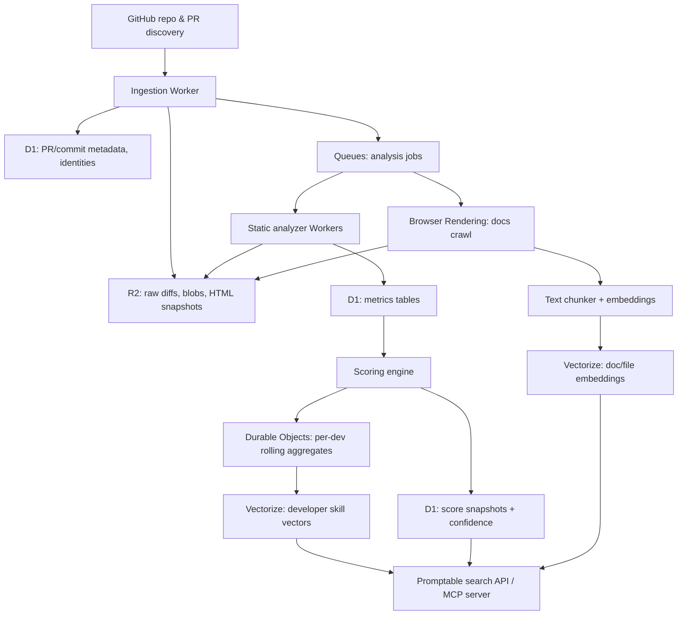

# Production-Grade Effort Scoring and Tagging for an Engineering Talent Sourcing Engine

## Executive summary

A production-grade engineering talent sourcing “scoring engine” should treat *effort* as an inferred, probabilistic latent variable and *quality + impact* as separate (and equally important) dimensions, because volume-only metrics (commit counts, PR counts) are well known to be misleading and easy to game. BlueOptima’s public materials explicitly caution against treating commit frequency as a KPI and instead emphasize a language-agnostic “Coding Effort” metric derived from dozens of static source code measures and contextual factors. citeturn4search4turn5view1turn4search25

A practical Cloudflare-native MVP can approximate “BlueOptima-like” signals by combining (a) change-size + dispersion metrics (churn, entropy, ownership, rework), (b) tractable static complexity deltas (cyclomatic complexity, dependency centrality proxies, maintainability proxies), and (c) workflow signals (review iteration, reviewer influence), then normalizing per-repo/per-language and weighting by confidence. The BlueOptima Global Benchmark materials also reveal a benchmark framing (peer-group normalization across a large universe, quarterly rolling windows) and a maintainability/quality metric (ART) defined as a proportion of effort that is “maintainable.” citeturn5view2turn3search19turn5view1

To make the product “promptable,” the tagging engine should produce (1) a hierarchical taxonomy label set (languages → frameworks → domains → tasks), (2) file-level and repo-level topic embeddings + LLM classification consensus, and (3) a per-developer skill vector generated as an effort-weighted, recency-weighted aggregation of high-confidence tags. GitHub’s Linguist is a strong baseline for language detection and exclusion of generated/vendored content, and Cloudflare Vectorize can hold embeddings for search. citeturn12search11turn12search3turn8search27turn8search1

## Metric survey for code effort and complexity

### How to interpret “effort” in source-controlled data

In source control, you observe *artifacts* (diffs, refactors, review threads), not time-on-task. Many academic and industry metrics therefore serve as *effort proxies*:

- **Static/product** metrics approximate *cognitive complexity* of code artifacts (e.g., cyclomatic complexity, Halstead metrics, maintainability index). citeturn0search24turn16search5turn11search26  
- **Process/change** metrics approximate *work and risk* embodied in changes (e.g., churn, entropy of changes, rework). citeturn18search21turn18search3turn12search14  
- **Socio-technical** metrics approximate *coordination overhead* and *knowledge distribution* (e.g., ownership dispersion, review interaction). citeturn17search3turn16search15turn10search2  

As a design rule: treat each metric as a **noisy sensor** of one or more latent constructs (effort, risk, maintainability), and use ensembles + normalization, not single-point scores. This aligns with the broader critique that many “tool metrics” are inconsistently validated and can mislead when used as standalone KPIs. citeturn17academia44turn4search4

### Comparison table of candidate metrics

The table below emphasizes the metrics you requested and adds a few “production-grade” complements that reduce gaming risk and improve attribution.

| Metric | Concise definition | Signal type | Cost to compute (GitHub-based) | Susceptibility to gaming | How it maps to developer effort (interpretation) |
|---|---|---|---|---|---|
| Cyclomatic complexity (McCabe) | Counts linearly independent control-flow paths; often approximated by counting decision points + 1. citeturn0search24 | Static/product | Medium (AST/control-flow per language) | Medium | Higher CC in touched functions tends to imply higher reasoning burden; **ΔCC** in a change is a proxy for added/removed branching complexity. citeturn0search24 |
| Halstead metrics | Token-based metrics derived from distinct/total operators and operands (volume, difficulty, “effort”); originally proposed as software science measures. citeturn11search26turn17search41 | Static/product | Low–Medium (tokenization) | Medium | Volume/difficulty correlate with “information content” of a change; “Halstead effort” is *controversial* as a time proxy and should be treated as a complexity proxy only. citeturn11search26turn11search24 |
| Maintainability Index (MI) | Composite index combining Halstead volume, cyclomatic complexity, and LOC (often scaled 0–100 in tooling); intended to reflect ease of maintenance. citeturn16search5turn15search5turn15search15 | Static/product | Medium | Medium | **ΔMI** (or MI percentile) indicates whether changes move code toward harder/easier maintenance; effort mapping is indirect and can be distorted by style/tool differences. citeturn15search8turn17academia44 |
| Lines changed / churn | Additions + deletions; “relative churn” variants normalize churn by component size and/or window. citeturn18search21turn18search1 | Process/change | Low (diff stats) | High | Captures mechanical work and surface area touched, but is heavily gameable; use log transforms + caps and combine with dispersion/complexity to reduce spam incentives. citeturn14search0turn4search4 |
| Relative churn (defect-oriented) | Suite of churn measures normalized by size/temporal extent; shown predictive of defect density in large-scale study. citeturn18search21turn18search1 | Process/change | Low | Medium | Effort proxy improves vs raw churn because it penalizes “small churn in huge modules” differently than “large churn in small modules,” approximating real change difficulty. citeturn18search21 |
| Change entropy | Shannon entropy of how changes are distributed across files/modules in a window; used to quantify change complexity and fault risk. citeturn18search3turn18search5 | Process/change | Low–Medium | Medium | High entropy implies high context switching/coordination burden; good proxy for “hard to reason about change,” especially for multi-file refactors. citeturn18search3 |
| Rework (line-level) | Fraction of recently modified lines that are modified again within a short window (commonly ~3 weeks); indicates instability/redo work. citeturn12search14turn12search2 | Process/change | Medium (history + blame) | Medium | High rework suggests wasted effort, unclear requirements, or poor initial quality; for talent scoring, penalize rework *unless* it’s clearly refactoring/cleanup with positive maintainability deltas. citeturn12search14turn15search8 |
| Test coverage (proxy) | Direct coverage is hard to compute from GitHub alone; proxies include “test code churn ratio,” “tests added with feature,” CI presence. Code coverage correlates weakly with effectiveness once suite size is controlled. citeturn10search2turn12search0 | Process/change | Medium–High | Medium | Tests added per unit of production change is a credibility/rigor proxy, but don’t treat coverage % as “quality” by itself. citeturn10search2 |
| Dependency centrality | Centrality measures (e.g., PageRank/degree/betweenness) on dependency graphs to identify “core” modules more defect-prone/impactful. citeturn16search8turn16search0 | Socio-technical/product | High (build dependency graph) | Low–Medium | Changing high-centrality components typically implies higher risk and higher review/coordination effort; strong “impact” proxy. citeturn16search8 |
| Ownership dispersion | Measures of how many people edit a file, share of top owner, proportion of low-expertise modifiers; associated with defects in large systems. citeturn17search2turn17search13 | Socio-technical | Medium | Medium | Working in low-ownership areas implies ramp-up cost; frequent edits by low-expertise devs can indicate risky modules or onboarding dynamics. citeturn17search2 |
| Code review interaction | Review comments, iterations, and review outcomes; modern code review yields benefits beyond defects (knowledge transfer, alternatives). citeturn16search15turn10search2 | Socio-technical/process | Medium | Medium | High iteration can imply hard change or unclear design; reviewer “accepted suggestions” can quantify non-author contribution. citeturn16search15turn15search2 |

**Design implication:** For “effort” inference, the most robust combination is typically **(log churn) + (change entropy) + (Δcomplexity/maintainability) + (centrality) + (ownership context)**, because each component covers failure modes the others miss. The importance of process metrics vs static metrics is also consistent with defect prediction literature showing change/process metrics can outperform static-only predictors in practical settings. citeturn12search9turn12search0

## Reverse-engineering likely BlueOptima-style signals and benchmarks

### What BlueOptima publicly reveals about their approach

From BlueOptima’s public “common terminology” materials:

- **Coding Effort (CE)** is described as effort delivered to make a change, based on evaluating each change against **36 static source code metrics**, with no time tracking, and expressible in hours as a statistical estimate for an “average developer.” citeturn5view1  
- **Actual Coding Effort (ACE)** is described as an internally benchmarked measure covering new code, refactoring, and removal. citeturn5view1  
- **Billable Coding Effort (BCE)** addresses “chunky commits” by prorating large commits backward across active days; BCE/day is capped at **5 hours/day** and prorated up to **nine active days** (per their description). citeturn5view1  

From the BlueOptima Global Benchmark report page (Q2 2025):

- The benchmark is **published quarterly** and uses the **preceding 12 months** of data. citeturn5view2  
- “Quality” is tied to **ART (Analysis of Relative Thresholds)**, described as an objective measure of maintainability based on static metrics and “how easy it is for a developer unfamiliar with the code to deliver change.” citeturn5view2  
- The report describes quality as a **proportion of BCE hours** spent delivering maintainable change. citeturn5view2  

From BlueOptima’s own writing, they argue against naïve volume metrics like commit frequency as a KPI (risking quantity over quality) and position Coding Effort as an alternative. citeturn4search4turn5view2

From their public LinkedIn messaging, they describe integrating with version control systems (including GitHub) and analyzing “every commit across over 150 file types using 36 static source code metrics” spanning volume, complexity, and interrelatedness. citeturn4search25

### Candidate “BlueOptima-like” signals and how to approximate them from GitHub + public docs

The table below enumerates plausible signals implied by their materials and a practical approximation strategy for an MVP.

| Candidate signal (BlueOptima-style) | What it likely represents (inference from public docs) | Approximation from GitHub + public docs | Notes on limitations |
|---|---|---|---|
| Per-change “Coding Effort” | Weighted function of static metrics + context (legacy vs new, coupling, complexity) producing “hours-equivalent” output. citeturn5view1turn4search25 | Compute a per-change effort unit: log churn + entropy + Δcomplexity + centrality + ownership context; calibrate by repo/language baselines. citeturn18search3turn16search8turn17search2 | You will not replicate their proprietary calibration without their dataset; treat as a different metric with transparent definition. |
| BCE/day proration | Anti-“chunky commit” correction; spreads large commits across active days, caps cognitive output/day. citeturn5view1 | Detect large PR/commit bursts and prorate across dev’s active days in a lookback window (e.g., last 7–10 active days), cap daily contribution. | Requires defining “active day” from GitHub activity; beware time zones and missing weekend context. |
| Maintainability “quality” (ART-like) | Thresholded maintainability model: “unfamiliar dev can change it” proxy; reported as % of effort that is maintainable. citeturn5view2 | Compute MI percentiles and/or “maintainability delta” per change; mark portion of change as “high-risk maintainability” if it worsens key metrics beyond thresholds. citeturn16search5turn15search5 | MI/thresholding is sensitive to tool/language; consider activity-based models as longer-term roadmap. citeturn17academia40turn15search8 |
| “Interrelatedness” | Coupling/dependency complexity (fan-in/out, dependency edges, call graph). citeturn4search25 | Build dependency graph from imports/build manifests; compute centrality; weight changes in high-centrality modules. citeturn16search8turn16search0 | Accurate dependency graphs are language/build-system specific (Maven/Gradle/npm/go mod/Cargo). |
| Benchmark normalization | Comparing devs across regions/industries via a global baseline distribution. citeturn5view2turn3search19 | Maintain public “global baselines” for open-source cohorts by language/domain; normalize scores into percentiles within peer groups. | Public GitHub populations differ from enterprise cohorts; label as “OSS benchmark,” not “industry benchmark.” |
| Workflow and PR-scale dataset | Their “Global Drivers” report claims millions of PRs analyzed. citeturn6view3 | Use PR objects as first-class entities (commits + reviews + discussions) rather than only commits; collect review/iteration metrics. citeturn8search9turn15search2 | Review signals vary widely across repos; must normalize by repo norms. |

**A key production insight:** BlueOptima’s public descriptions imply they treat both **(a) output complexity/context** and **(b) distribution/benchmarking** as core; a talent-sourcing product should mirror this by (1) computing per-change effort units and (2) converting them into percentiles within well-defined peer cohorts (language, domain, repo maturity). citeturn5view1turn5view2turn14search0

## Effort scoring models

This section proposes three scoring models—simple, hybrid, and advanced—designed to be implementable incrementally while remaining production-grade in their statistical hygiene (normalization, confidence, anti-gaming).

### Input primitives and normalization strategy

**Event primitives**

- **Change event**: a commit or PR diff (additions/deletions, files touched, metadata). citeturn8search9turn8search2  
- **Review event**: review body + inline comments + approvals/requests changes. citeturn15search2turn8search36  
- **Attribution event**: mapping “who did the work” across author vs committer vs reviewer; GitHub exposes identity via commit/PR fields and timeline events. citeturn8search2turn8search5  

**Normalization**

1. **Log-transform size-like metrics** (churn, files touched) because commit sizes follow heavy-tailed/power-law-like distributions in OSS. citeturn14search0turn14search12  
2. **Normalize per repository and per language** (robust z-score or percentile) because coding style and architectural norms differ dramatically between repos/languages (e.g., Java vs Go vs JS).  
3. **Winsorize extremes** (e.g., 99.5th percentile) and use **caps** for daily scoring (an idea consistent with BlueOptima’s 5-hour/day cap framing). citeturn5view1  
4. Attach a **confidence score** to each computed metric based on parser coverage, language support, and whether the diff includes generated/vendored code (use Linguist-like rules). citeturn12search3turn12search11  

### Simple model

**Goal:** low-cost scoring using only diff stats + dispersion. Suitable as MVP baseline.

**Features (per PR or per commit)**

- `Churn = additions + deletions`
- `F = number_of_files_changed`
- `H = normalized_change_entropy`  
  - Compute file-change proportions `p_i = churn_in_file_i / total_churn`  
  - Shannon entropy `E = -Σ p_i log2(p_i)`  
  - Normalize `H = E / log2(F)` so `H ∈ [0,1]` (define `H=0` if `F=1`). citeturn18search3  

**Formula**

\[
\text{SEU} = \ln(1 + \text{Churn}) \cdot \left(1 + 0.15\ln(1+F)\right)\cdot\left(1 + 0.20H\right)
\]

**Rationale**

- Log churn reduces incentive to spam large diffs and stabilizes heavy tails. citeturn14search0  
- Entropy captures multi-file cognitive complexity beyond size. citeturn18search3  

### Hybrid model

**Goal:** approximate “contextual effort” + quality gating, incorporating static code metrics where feasible and separating effort from quality.

**Additional features**

- `ΔCC_abs`: sum of absolute cyclomatic complexity deltas across impacted functions/modules (or approximation by analyzing changed functions). citeturn0search24  
- `Centrality`: percentile of dependency centrality for touched modules (0–1). citeturn16search8  
- `MaintainableShare`: fraction (0–1) of change that passes maintainability thresholds (your ART-like approximation). citeturn5view2turn16search5  
- `TestRatio = test_churn / (test_churn + prod_churn)` (heuristic path-based classification for tests).  
- `ReworkRate`: fraction of touched lines re-touched within 21 days (or configurable window). citeturn12search14  

**Formulas**

Effort component:
\[
\text{EffortH} = \text{SEU} \cdot (1 + 0.03\Delta CC_{abs}) \cdot (1 + 0.5\cdot \text{Centrality})
\]

Quality component (clamped to \[0.4, 1.2\]):
\[
\text{QualityH} = \text{clamp}\left(0.8 + 0.2\cdot \text{MaintainableShare} + 0.3\cdot \text{TestRatio} - 0.5\cdot \text{ReworkRate}\right)
\]

Final “value”:
\[
\text{ValueH} = \text{EffortH}\cdot \text{QualityH}
\]

**Rationale**

- Dependency centrality can indicate high-impact, high-risk work where quality assurance effort matters. citeturn16search8turn16search0  
- Rework captures instability/redo work; treat as negative unless accompanied by improved maintainability deltas. citeturn12search14turn15search8  
- Test coverage is not a reliable proxy for effectiveness alone; using test ratio as a *weak positive* avoids overclaiming. citeturn10search2  

### Advanced model

**Goal:** production-grade attribution and de-noising: allocate credit across co-authors, committers, and reviewers; incorporate probabilistic authorship for suspicious attribution; add reviewer influence.

**Attribution framework**

Let a PR consist of events \(e \in \{\text{commits}, \text{review-influenced edits}\}\). For each event \(e\), estimate \(p(a \mid e)\): probability that developer \(a\) is the *actual contributor*.

\[
\text{Score}(a) = \sum_{e}\, p(a\mid e)\cdot \text{ValueH}(e) \;+\; \sum_{r\in \text{reviews}} \text{ReviewCredit}(a,r)
\]

**Probabilistic attribution (“style fingerprinting”)**

Code stylometry research shows it is possible to attribute code authorship using structural/lexical features and ML, which implies a viable (but privacy-sensitive) approach to detect cases where commit metadata is misleading. citeturn10search0turn10search4

Practical approach:

1. Train per-dev stylometry embeddings using historical patches (AST n-grams, formatting, identifier patterns). citeturn10search0  
2. For a new patch, compute similarity to dev profiles → produce \(p_{style}(a\mid e)\).  
3. Combine with metadata prior \(p_{meta}(a\mid e)\) (author/committer/PR author) to get posterior \(p(a\mid e)\) via Bayes rule.

**Reviewer influence**

Modern code review is not only defect finding; it is also alternative solutions and knowledge transfer. citeturn16search15  
Compute reviewer influence by linking review comments to subsequent edits in the commented hunks/files and credit reviewers proportionally to accepted suggestions.

\[
\text{ReviewCredit}(reviewer) = \alpha \cdot \text{ValueH(PR)} \cdot \text{AcceptedSuggestionShare}
\]

Where `AcceptedSuggestionShare` can be approximated as the fraction of final diff lines that were modified *after* a reviewer’s comments in the discussed contexts.

**Handling author vs committer**

Use commit `author` as the default code contributor; treat `committer` as an integration agent (especially for bots/maintainers) unless stylometry or other evidence indicates otherwise. This is aligned with the need to disambiguate “who clicked merge” from “who wrote the code” in Git-based systems. citeturn8search2turn8search5

### Worked example calculations on three synthetic PR scenarios

Below are example inputs and the resulting scores for each model. Values are illustrative to show mechanics; production should compute features directly and normalize per peer group.

#### Scenario definitions

| Scenario | Churn | Files (F) | Entropy (H) | ΔCC_abs | Centrality | MaintainableShare | Test churn | ReworkRate |
|---|---:|---:|---:|---:|---:|---:|---:|---:|
| Small bugfix | 7 | 1 | 0.00 | 1 | 0.70 | 0.95 | 0 | 0.10 |
| Feature addition | 270 | 6 | 0.88 | 25 | 0.50 | 0.90 | 120 | 0.05 |
| Large refactor | 900 | 25 | 1.00 | 70 | 0.90 | 0.97 | 20 | 0.15 |

(Entropy values follow the change-entropy definition normalized to \[0,1].) citeturn18search3

#### Simple model results (SEU)

Using:
\[
\text{SEU} = \ln(1 + \text{Churn}) \cdot (1 + 0.15\ln(1+F))\cdot(1 + 0.20H)
\]

- Small bugfix: **SEU ≈ 2.30**  
- Feature addition: **SEU ≈ 8.52**  
- Large refactor: **SEU ≈ 12.15**

Interpretation: refactor is largest due to many files and high churn; feature addition is next; bugfix is small.

#### Hybrid model results (EffortH, QualityH, ValueH)

Effort:
\[
\text{EffortH} = \text{SEU} \cdot (1 + 0.03\Delta CC_{abs}) \cdot (1 + 0.5\cdot \text{Centrality})
\]

Quality:
\[
\text{QualityH} = \text{clamp}\left(0.8 + 0.2\cdot \text{MaintainableShare} + 0.3\cdot \text{TestRatio} - 0.5\cdot \text{ReworkRate}\right)
\]

Results:

| Scenario | EffortH | QualityH | ValueH (= EffortH × QualityH) |
|---|---:|---:|---:|
| Small bugfix | 3.19 | 0.94 | **3.00** |
| Feature addition | 18.63 | 1.05 | **19.51** |
| Large refactor | 54.63 | 0.93 | **50.56** |

Interpretation: refactor is “hard” but quality is slightly penalized by rework/test ratio; feature addition benefits from test ratio and remains strong.

#### Advanced model results (multi-author + reviewer influence)

Assume:

- **Feature addition PR**: code authored 70% by Dev A, 30% by Dev B; reviewer Dev R influenced 12% of meaningful edits; review credit factor \(\alpha=0.30\).  
- **Large refactor PR**: initial attribution A=60%, B=40%, but stylometry shifts 25% of B’s share to A (privacy-sensitive; only if enabled); reviewers R1/R2/R3 influence 10%/5%/3% with \(\alpha=0.25\). citeturn10search0turn16search15  

Example outputs (using ValueH above):

- Feature PR code value:  
  - Dev A: 0.70 × 19.51 = **13.66**  
  - Dev B: 0.30 × 19.51 = **5.85**  
  - Reviewer Dev R credit: 0.30 × 19.51 × 0.12 = **0.70**
- Refactor PR code value (after stylometry shift: A=70%, B=30%):  
  - Dev A: 0.70 × 50.56 = **35.39**  
  - Dev B: 0.30 × 50.56 = **15.17**  
  - Reviewers:  
    - R1: 0.25 × 50.56 × 0.10 = **1.26**  
    - R2: 0.25 × 50.56 × 0.05 = **0.63**  
    - R3: 0.25 × 50.56 × 0.03 = **0.38**

**Production caveat:** stylometry is powerful and can be a privacy risk; it should be opt-in, minimized, and used primarily for anomaly detection rather than “secret attribution.” citeturn10search0turn10search4

### Example score distribution charts

These charts illustrate typical *shape* you should expect after log normalization (many small changes, few large ones, consistent with empirical commit-size studies). citeturn14search0turn14search12

**Synthetic distribution of per-change Effort Units (0–20 scale, 1,000 changes)**

```
 0–1  | ██████████████████████████████████████   255
 1–2  | ████████████████████████████████████████ 264
 2–3  | ████████████████████████                 163
 3–4  | ████████████████                         107
 4–5  | ████████                                 55
 5–6  | █████                                    38
 6–8  | █████                                    38
 8–10 | ████                                     30
10–12 | ██                                       17
12–15 | █                                        12
15–20 | ███                                      21
```

**Synthetic distribution of developer-level weekly scores (0–100 scale, 200 developers)**

```
  0–10  | █████████████████████████                28
 10–20  | ████████████████████████████████████     40
 20–30  | ████████████████████████████████████████ 44
 30–40  | ████████████████████████████             31
 40–50  | ██████████████████                       20
 50–60  | ████████████                             14
 60–70  | █████████                                10
 70–80  | ███                                      4
 80–90  | ███                                      4
 90–100 | ████                                     5
```

## Tagging engine design for promptable search

### Taxonomy and tag granularity

A production-grade taxonomy should be hierarchical and allow both **file-level** and **repo-level** tagging:

- **Language & platform layer**: primary languages, build systems, runtime targets (server, browser, mobile, embedded). GitHub Linguist is a strong baseline approach for language labeling and exclusion rules. citeturn12search11turn12search3turn12search7  
- **Framework/tooling layer**: e.g., React/Next.js, Spring, Django, Tokio, CUDA, Terraform, Kubernetes, etc.  
- **Domain layer (subject areas)**: distributed systems, databases, compilers, ML systems, cryptography, observability, security tooling, developer tools, UI systems, etc.  
- **Task layer**: performance optimization, refactoring, incident response fixes, test engineering, API design, etc.

**Granularity guidance**

- **File-level tags** are best for precise skill extraction (“this dev touched k8s manifests and Go concurrency code”).  
- **Repo-level tags** are best for long-lived expertise signals (“this repo is an LSM-tree KV store”).  
- **PR-level tags** bridge the two (what the dev actually delivered).

### Detection pipeline: language → topic → skills

**Language detection**

1. Start with GitHub’s language stats (Linguist-based) and file extensions. citeturn12search11turn12search3  
2. Apply exclusions: generated/vendored/binary/docs as per Linguist rules to avoid inflated skill inference from vendored code. citeturn12search3  

**Topic modeling (hybrid embeddings + classification)**

A robust tagging engine uses an ensemble:

- **Embedding-based clustering / retrieval**: compute embeddings for (a) file paths + identifiers + doc snippets and (b) README/docs sections. Store in Cloudflare Vectorize for semantic search and similarity-based labeling. citeturn8search27turn8search1turn8search12  
- **LLM-assisted classification**: map candidate tags to the taxonomy with calibrated confidence; Cloudflare Workers AI can be used for embedding/classification workloads, and AI Gateway can provide observability/rate limiting across model providers. citeturn15search10turn15search13turn15search3  
- **Rule-based detectors** (high precision): dependency manifests (package.json, go.mod, Cargo.toml), CI configs, infra manifests, and well-known directory patterns.

**Confidence scoring**

For each tag \(t\), compute:
- `EvidenceWeight`: sum of evidence signals (manifest hit, identifier match, embedding similarity, LLM vote).  
- `Coverage`: fraction of changed code/text the tag explains.  
- `Stability`: persistence across time (e.g., appears in ≥N PRs over ≥M weeks).  

Then:
\[
P(t) = \sigma\left(w_1 \cdot EvidenceWeight + w_2 \cdot Coverage + w_3 \cdot Stability - w_4 \cdot Noise\right)
\]

Where `Noise` includes suspected vendored/generated content and low-confidence parsing.

### Skill vectors for promptable search

Represent each developer as a vector over tags:

\[
\vec{s}_{dev} = \sum_{\text{events }e} \Big(\text{Value}(e)\cdot \text{RecencyWeight}(e)\cdot \text{QualityWeight}(e)\Big)\cdot \vec{t}(e)
\]

- `Value(e)` from the scoring model (EffortH or Advanced).  
- `RecencyWeight` can be exponential decay (e.g., half-life 90–180 days).  
- \(\vec{t}(e)\) is a sparse or embedded representation of tags.

For retrieval:

1. Embed the user prompt (“Find senior Rust distributed systems developers with storage engine work”).  
2. Vector search over developer skill embeddings (Vectorize). citeturn8search27turn8search1  
3. Re-rank with structured constraints (language, domain tags, thresholds, anti-gaming flags).

## Data pipeline and Cloudflare-native infrastructure

### Required GitHub data fields and API constraints

**Core data you will need**

- Repository metadata, default branch, languages. citeturn12search11turn8search17  
- Pull requests: author, mergedBy, commits, changed files, additions/deletions, timeline events, review threads/comments. citeturn8search9turn15search2turn15search6  
- Commits: author vs committer identity, timestamps, parents/merge commits, file diffs (patch). citeturn8search2turn8search5  

**Rate limits are real constraints**

GitHub GraphQL uses a point-based primary rate limit and also applies secondary rate limits; production ingestion must queue, batch, and cache. citeturn8search3turn8search6

### Crawler and browser rendering for public docs

Many developer docs are client-rendered; to reliably extract content you need a headless browser option. Cloudflare Browser Rendering runs headless Chrome and supports both REST and Workers bindings; costs are based on browser hours (and concurrency for bindings). citeturn9search6turn9search3

Cloudflare’s Agents documentation explicitly shows an agent method that leverages Browser Rendering to visit URLs and extract content—useful for an MCP “research agent” that gathers public docs and README context for tagging. citeturn9search35

### Storage and compute building blocks on Cloudflare

Use a layered storage approach:

- **R2**: raw artifacts (diff patches, rendered HTML snapshots, embeddings input blobs). R2 pricing is based on storage + operations and has no egress fees. citeturn9search1  
- **D1**: relational facts (developers, repos, PR metadata, computed metrics, score snapshots). D1 is SQLite-based and priced on query + storage; designed for multiple smaller (10GB) DBs. citeturn9search4turn9search10  
- **Durable Objects**: stateful coordination (per-developer aggregation windows, queue deduplication, incremental score updates). citeturn8search4turn9search18  
- **KV**: caching of hot lookups (repo configs, last-indexed SHAs). citeturn8search11turn8search0  
- **Queues**: async fan-out for analysis jobs (metrics computation, doc crawl, embedding). Queues are designed for guaranteed delivery and integrate with Workers. citeturn9search8turn9search2  
- **Vectorize**: vector database for embeddings-based retrieval (repo/doc/file embeddings and developer skill vectors). citeturn8search27turn8search1  
- **Workers AI + AI Gateway**: embeddings and classification + observability/caching/rate limiting. citeturn15search10turn15search3turn15search33  

**Compute considerations**

Workers pricing is request + CPU-ms based and supports longer CPU limits on paid plans; you should push heavy parsing into queued consumers and/or Durable Objects where appropriate. citeturn9search5turn8search30

### Mermaid flowchart: end-to-end pipeline



## Implementation estimates for MVP vs advanced system

### Scope definition

- **MVP**: supports a subset of languages (e.g., TypeScript/JavaScript, Python, Go, Java), computes Simple + partial Hybrid metrics (churn, entropy, basic CC where parser exists), repo/doc tagging, and promptable developer search.  
- **Advanced**: expands to multi-language AST metrics, dependency centrality per ecosystem, reviewer influence, rework/ownership at line granularity, stylometry-assisted anomaly detection, stronger benchmarking cohorts, and a human-in-the-loop review console.

### Engineering task breakdown and rough person-week estimates

Estimates assume experienced engineers; wide ranges reflect variability in language support and data quality.

**MVP (8–12 weeks calendar with 3–4 engineers; ~30–45 person-weeks)**

- GitHub ingestion + identity graph (users, emails, bots, aliases): 4–6 pw  
- Diff storage + batching + rate-limit handling (Queues + KV caching): 4–6 pw citeturn8search3turn9search8  
- Simple scoring engine (SEU), normalization, percentiles: 4–6 pw citeturn14search0turn18search3  
- Tagging MVP (Linguist + manifests + embeddings + LLM classifier): 8–12 pw citeturn12search3turn8search27turn15search10  
- Search API (Vectorize retrieval + filters + re-rank): 4–6 pw citeturn8search27turn8search1  
- Minimal UI + admin tooling + observability: 6–9 pw  

**Advanced (additional 4–6 months; +80–140 person-weeks)**

- Multi-language AST + complexity deltas + MI variants: 20–35 pw citeturn0search24turn16search5turn15search5  
- Dependency graph extraction + centrality metrics per ecosystem: 15–30 pw citeturn16search8turn16search0  
- Ownership/rework line-level computation (blame + time-window index): 10–20 pw citeturn12search14turn17search2  
- Reviewer influence attribution + PR timeline modeling: 10–18 pw citeturn15search2turn16search15  
- Stylometry-assisted anomaly detection (opt-in) + privacy controls: 10–20 pw citeturn10search0turn10search4  
- Benchmark cohorts + calibration + eval harness (offline): 15–25 pw citeturn5view2turn14search0  

### Data labeling needs

For tagging, you can reduce labeling by:

- Starting taxonomy labeling from manifests + repo topics + README headings (weak supervision).  
- Using LLM labeling with human spot-checking for calibration, then training lighter models for scale.  
For reviewer influence and stylometry, expect substantial evaluation work on false positives to avoid reputational harm. citeturn10search0turn16search15

### Rough infrastructure cost ranges (Cloudflare-centric)

Costs vary primarily with **(a) number of PRs/commits analyzed**, **(b) amount of Browser Rendering time**, and **(c) embedding/LLM usage**.

- **Workers**: $5/mo base paid plan; usage billed per request and CPU-ms beyond included allotments. citeturn9search5turn8search0  
- **Browser Rendering**: included browser hours, then ~$0.09/hour beyond included; concurrency charges apply for bindings usage. citeturn9search3turn9search9  
- **Vectorize**: billed by stored vector dimensions and queried dimensions; the docs emphasize dimension-based billing. citeturn8search1turn8search35  
- **Workers AI**: priced per “neurons” with a daily free allocation and pay-as-you-go above it. citeturn15search10  
- **Queues / R2 / D1**: each has usage-based pricing (operations, storage, reads/writes). citeturn9search2turn9search1turn9search0  
- **AI Gateway**: core features are listed as free; useful for caching, rate limiting, and cost observability. citeturn15search3turn15search33  

A reasonable budgeting frame:
- **MVP pilot (tens of repos, low crawl volume):** tens to low hundreds of USD/month.  
- **Production (thousands of repos, heavy embeddings + crawling):** hundreds to low thousands/month, dominated by embeddings + Browser Rendering + Vectorize query volume.

## Anti-gaming, robustness, and privacy/ethics constraints

### Anti-gaming heuristics that specifically address talent sourcing failure modes

**Commit/PR spam resistance**

- Avoid commit counts and raw churn as primary KPIs; BlueOptima explicitly warns these incentives degrade quality. citeturn4search4  
- Use log transforms + caps (heavy-tailed commit sizes) to limit marginal gain from inflating diffs. citeturn14search0  
- Discount generated/vendored code using Linguist-style exclusions. citeturn12search3turn12search7  
- Penalize high rework unless paired with improved maintainability deltas (distinguish flailing from refactoring). citeturn12search14turn15search8  

**Reviewer gaming resistance**

- Only credit reviewer influence when comments map to actual subsequent edits (accepted-suggestion share).  
- Rate-limit review credit per PR to avoid “comment spam.” Modern code review produces multiple benefits, but the signal should be grounded in observed outcomes. citeturn16search15  

**Anomaly detection**

- Detect “burst patterns” (large proration events), identity anomalies (many emails, frequent author/committer mismatch), and sudden topic shifts inconsistent with historical skill vectors.  
- Use robust statistics (median/MAD) to flag outliers rather than mean-based thresholds, consistent with heavy-tailed properties of commit sizes. citeturn14search0  

### Human-in-the-loop review

For a talent product, false positives are reputationally expensive. Recommended HIL pattern:

- Automatic ranking → “evidence packet” (top PRs, concise summaries, key metrics deltas, doc links) → human confirmation before outreach.

This also helps meet the product goal of identifying “who is actually doing the work,” by presenting concrete artifacts (merged PRs, accepted reviews, ownership in core modules) rather than opaque scores. This aligns with BlueOptima’s positioning of “objective metrics” derived from code outputs rather than subjective signals. citeturn5view1turn4search4

### Privacy and ethical constraints

**Respect platform terms and developer expectations**

- Prefer official APIs and public data; build opt-out and transparency (what data, what scoring, what retention). GitHub API limits and governance already enforce constraints you must engineer around. citeturn8search3turn8search6  

**Be careful with authorship inference**

Code stylometry demonstrates that authors can be inferred from code style at high accuracy, which is a privacy threat; using such techniques for “who really wrote this” needs strict safeguards (opt-in, minimal retention, security controls, and careful UI language). citeturn10search0turn10search4  

**Avoid overclaiming “effort” as time**

BlueOptima positions its effort measures as statistical estimates (not time tracking) and imposes cognitive caps in its public explanations. Any MVP should similarly avoid implying literal hours worked and instead present “effort units” or “relative effort percentiles,” with clear definitions. citeturn5view1turn5view2